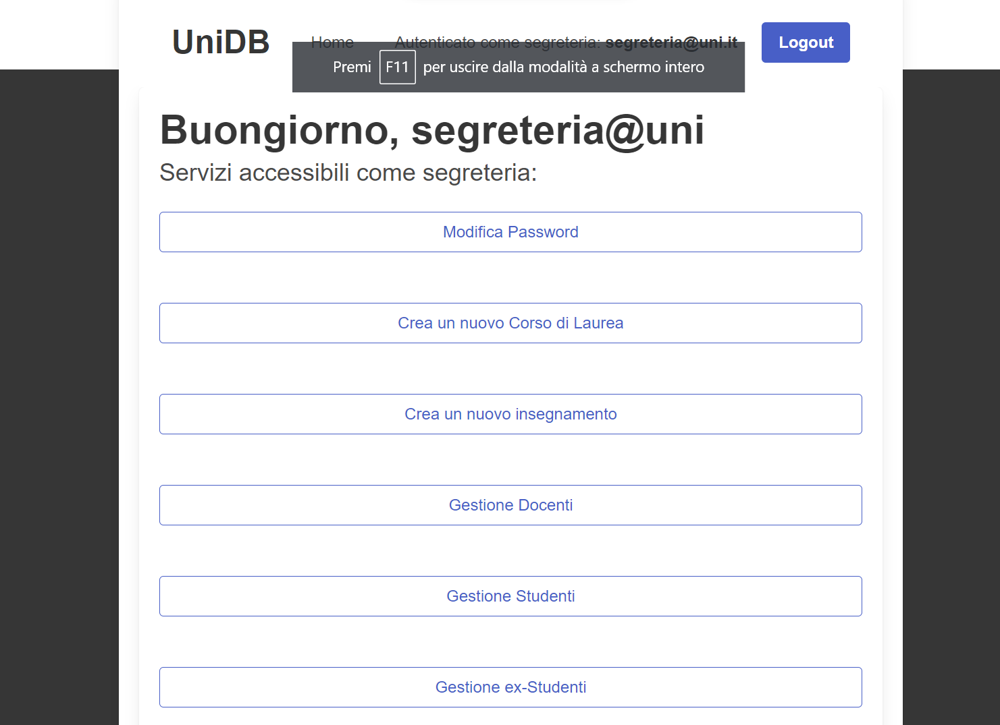
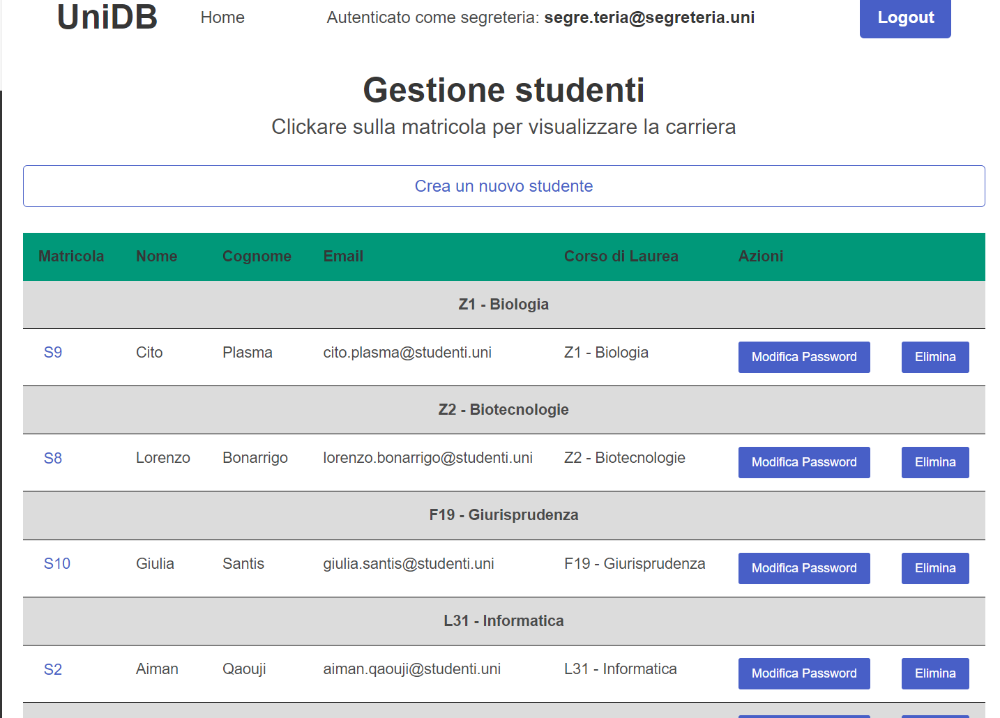
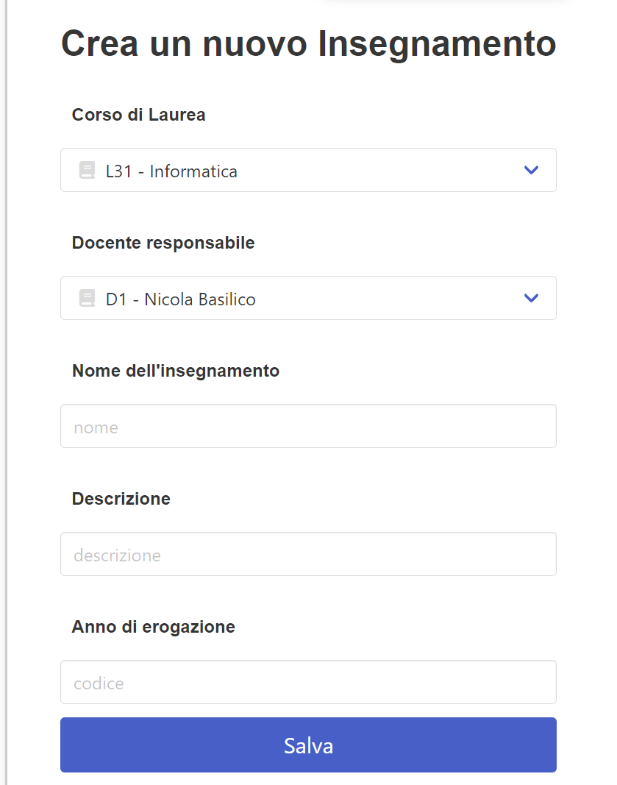

# Piattaforma per la gestione dei servizi universitari
Relazione del progetto "Piattaforma per la gestione degli esami universitari" (UniDB) per il corso di Basi Di dati, appello del 18/01/2024.

Realizzato da Aiman Qaouji, 982535

Per accedere a qualsiasi account di UniDB, la password è 12345. Le email sono tutte visibili dall'account della segreteria (segre.teria@segreteria.uni).


- [Piattaforma per la gestione dei servizi universitari](#piattaforma-per-la-gestione-dei-servizi-universitari)
  - [Installazione delle componenti](#installazione-delle-componenti)
  - [Struttura](#struttura)
  - [Database: Struttura e funzionalità](#database-struttura-e-funzionalità)
    - [Generalizzazione users](#generalizzazione-users)
    - [Storici carriera e storici studente](#storici-carriera-e-storici-studente)
    - [Appelli e verbalizzazione](#appelli-e-verbalizzazione)
    - [Appelli d'esame: Programmazione e cancellazione](#appelli-desame-programmazione-e-cancellazione)
    - [Insegnamenti](#insegnamenti)
    - [Iscrizione a un'esame](#iscrizione-a-unesame)
  - [Applicazione Web](#applicazione-web)
    - [Strumenti supplementari](#strumenti-supplementari)
    - [Accesso (log-in)](#accesso-log-in)
    - [Homepage](#homepage)
    - [Pagina di Gestione](#pagina-di-gestione)
    - [Pagina di form](#pagina-di-form)

## Installazione delle componenti
Per l'installazione delle componenti si faccia riferimento al [manuale utente](manuale_utente.md).
## Struttura
* **database:** Il dump del database è contenuto nella cartella **progetto/database**, contenente: due script sql (uno per la creazione e l'altro per la popolazione del database), e due immagini riportanti gli schemi ER e logico.
* **WebApp:** Tutti i file PHP e CSS sono contenuti nella cartella **progetto/webapp**.
* **docs:** Documentazione è interamente contenuta nella cartella corrente.

## Database: Struttura e funzionalità
### Generalizzazione users
Lo schema ER presenta una gerarchia tra l'entità padre users e le entità figlie segreteria, docente e studente.
Ho implementato questa gerarchia in quanto vi è un attributo comune a tutti (**email**) e per distinguere concettualmente l'**utente** (entità generalizzata che accede all'applicazione con email e password) dal **tipo di utente** (entità che in base alla sua natura può accedere a determinati servizi/funzionalità/tabelle).

### Storici carriera e storici studente
Quando uno studente consegue la Laurea (ovvero supera tutti gli esami previsti nel suo corso di laurea) oppure rinuncia agli studi, le sue informazioni vengono archiviate automaticamente: I dati delle tabelle **unidb.studente** e **unidb.carriera_esame** vengono caricati, rispettivamente, nelle tabelle speculari **unidb.storico_studente** e **unidb.storico_carriera**. Tutto ciò grazie all'implementazione del trigger **storico_trigger** che fa uso del meotodo **studente_carriera_storico**:

```sql
CREATE OR REPLACE TRIGGER storico_trigger
    BEFORE DELETE
    ON unidb.studente
    FOR EACH ROW
    EXECUTE FUNCTION public.studente_carriera_storico();

CREATE OR REPLACE FUNCTION public.studente_carriera_storico()
    RETURNS trigger
    LANGUAGE 'plpgsql'
    COST 100
    VOLATILE NOT LEAKPROOF
AS $BODY$
begin 
insert into unidb.storico_studente values(old.matricola, old.nome, old.cognome, old.anno, old.email, old.codice_cdl);
insert into unidb.storico_carriera
select * from unidb.carriera_esame where matricola = old.matricola;
return old;
end;

$BODY$;

ALTER FUNCTION public.studente_carriera_storico()
    OWNER TO postgres;
```

### Appelli e verbalizzazione
Quando a uno studente viene verbalizzato il voto di un determinato esame, questo voto viene registrato nella tabella **unidb.carriera_esame**. Sarebbe ragionevole che questo studente venga anche disiscritto dall'appello in cui ha sostenuto quell'esame una volta verbalizzato, per evitare informazioni ridondanti nella pagina di gestione degli studenti iscritti del docente. ragion per cui ho implementato il seguente trigger **after_insert_carriera_esame**:

```sql
CREATE OR REPLACE TRIGGER after_insert_carriera_esame
    AFTER INSERT
    ON unidb.carriera_esame
    FOR EACH ROW
    EXECUTE FUNCTION public.disiscrivi_dopo_verbalizzazione();

CREATE OR REPLACE FUNCTION public.disiscrivi_dopo_verbalizzazione()
    RETURNS trigger
    LANGUAGE 'plpgsql'
    COST 100
    VOLATILE NOT LEAKPROOF
AS $BODY$
BEGIN
  -- Cancella l'iscrizione dello studente all'esame dopo la verbalizzazione
  DELETE FROM unidb.iscrizione_esame
  WHERE matricola = NEW.matricola
    AND codice_esame = NEW.codice_esame;

  RETURN NEW;
END;
$BODY$;

ALTER FUNCTION public.disiscrivi_dopo_verbalizzazione()
    OWNER TO postgres;
```

### Appelli d'esame: Programmazione e cancellazione
La creazione o la cancellazione di un appello presentano due criticità:
* Un docente non dovrebbe poter eliminare un appello se ci sono studenti iscritti;
* Un docente non dovrebbe poter creare un appello se in quel giorno è previsto già un altro appello dello stesso CDL e anno accademico
  
Anche questi due problemi vengono ovviati, rispettivamente, con i trigger **before_delete_esame**:

```sql
CREATE OR REPLACE TRIGGER before_delete_esame
    BEFORE DELETE
    ON unidb.esame
    FOR EACH ROW
    EXECUTE FUNCTION public.check_iscrizioni_before_delete();

CREATE OR REPLACE FUNCTION public.check_iscrizioni_before_delete()
    RETURNS trigger
    LANGUAGE 'plpgsql'
    COST 100
    VOLATILE NOT LEAKPROOF
AS $BODY$
DECLARE
  esame_count INTEGER;
BEGIN
  -- Controlla se ci sono iscrizioni per l'esame
  SELECT COUNT(*)
  INTO esame_count
  FROM unidb.iscrizione_esame
  WHERE codice_esame = OLD.codice_esame;

  -- Se ci sono iscrizioni, annulla la cancellazione
  IF esame_count > 0 THEN
    RAISE EXCEPTION 'Impossibile cancellare l''esame, ci sono studenti iscritti.';
  END IF;

  -- Se non ci sono iscrizioni, permetti la cancellazione
  RETURN OLD;
END;
$BODY$;

ALTER FUNCTION public.check_iscrizioni_before_delete()
    OWNER TO postgres;
```


 e **programmazione_esame_trigger**:

```sql
CREATE OR REPLACE TRIGGER programmazione_esame_trigger
    BEFORE INSERT OR UPDATE 
    ON unidb.esame
    FOR EACH ROW
    EXECUTE FUNCTION public.check_inserimento_esame();

CREATE OR REPLACE FUNCTION public.check_inserimento_esame()
    RETURNS trigger
    LANGUAGE 'plpgsql'
    COST 100
    VOLATILE NOT LEAKPROOF
AS $BODY$

begin 

perform *
FROM unidb.insegnamento i INNER JOIN unidb.esame e ON i.codice_i = e.codice_i
WHERE e.data_esame = new.data_esame AND e.codice_cdl = new.codice_cdl AND i.anno_erogazione = (
	select anno_erogazione
	from unidb.insegnamento
	where insegnamento.codice_i = new.codice_i AND insegnamento.codice_cdl = new.codice_cdl
);

IF FOUND THEN RAISE 'Errore: in questa data è già previsto un esame dello stesso CDL e anno di erogazione'; RETURN NULL;
ELSE RETURN NEW;
END IF;

END;
$BODY$;

ALTER FUNCTION public.check_inserimento_esame()
    OWNER TO postgres;
```

### Insegnamenti
Come richiesto, nelle specifiche è presente un controllo di Insegnamenti massimi che un docente può sostenere (3), grazie al trigger **max_insegnamenti_trigger**:

```sql
CREATE OR REPLACE TRIGGER max_insegnamenti_trigger
    BEFORE INSERT OR UPDATE 
    ON unidb.insegnamento
    FOR EACH ROW
    EXECUTE FUNCTION public.maxcheck_insegnamenti_docente();

CREATE OR REPLACE FUNCTION public.maxcheck_insegnamenti_docente()
    RETURNS trigger
    LANGUAGE 'plpgsql'
    COST 100
    VOLATILE NOT LEAKPROOF
AS $BODY$
DECLARE
numero_insegnamenti INT;
BEGIN

SELECT COUNT(codice_i) INTO numero_insegnamenti
FROM unidb.insegnamento i INNER JOIN unidb.docente d on i.docente = d.codice_docente
WHERE new.docente = d.codice_docente;

IF numero_insegnamenti >= 3 THEN RAISE 'Ogni docente può avere al massimo 3 insegnamenti di cui è responsabile.';
RETURN NULL;
ELSE RETURN new;
END IF;

END;
$BODY$;

ALTER FUNCTION public.maxcheck_insegnamenti_docente()
    OWNER TO postgres;
```

### Iscrizione a un'esame 
Uno studente, per iscriversi ad un esame, ha come vincoli quello di iscriversi ad un esame facente parte del suo piano di studi, e quello di aver soddisfatto tutte le propedeuticità richieste da quell'esame. Questo controllo è effettuato dal trigger **iscrizione_trigger**:

```sql
CREATE OR REPLACE TRIGGER iscrizione_trigger
    BEFORE INSERT
    ON unidb.iscrizione_esame
    FOR EACH ROW
    EXECUTE FUNCTION public.check_iscrizione_esame();

CREATE OR REPLACE FUNCTION public.check_iscrizione_esame()
    RETURNS trigger
    LANGUAGE 'plpgsql'
    COST 100
    VOLATILE NOT LEAKPROOF
AS $BODY$

DECLARE 
propedeuticita_richieste INT;
propedeuticita_passate INT;

BEGIN

SELECT COUNT(propedeuticita) INTO propedeuticita_richieste
FROM unidb.propedeuticita
WHERE codice_i = (
	select e.codice_i
	from unidb.insegnamento i inner join unidb.esame e on i.codice_i = e.codice_i
	where new.codice_esame = e.codice_esame
);

SELECT COUNT(distinct i.codice_i) INTO propedeuticita_passate
FROM unidb.carriera_esame c inner join unidb.esame e on c.codice_esame = e.codice_esame 
INNER JOIN unidb.insegnamento i ON e.codice_i = i.codice_i
WHERE c.matricola = new.matricola AND c.codice_i in (
	select propedeuticita
	from unidb.propedeuticita
	where codice_i = (
		select e1.codice_i
		from unidb.insegnamento i1 inner join unidb.esame e1 on i1.codice_i = e1.codice_i
		where new.codice_esame = e1.codice_esame
	)
)AND c.voto >= 18;

IF propedeuticita_richieste = propedeuticita_passate THEN RETURN NEW;
ELSE RAISE 'Non puoi iscriverti a questo esame in quanto non fa parte del tuo piano di studi o non hai le propedeuticita richieste.';
RETURN NULL;
END IF;
END;
$BODY$;

ALTER FUNCTION public.check_iscrizione_esame()
    OWNER TO postgres;
```

## Applicazione Web
Per la maggior parte del sito web le pagine possono essere di due "categorie": **pagine contenenti una lista di informazioni e dati (racchiusi da una tabella)**, oppure **pagine di accesso, creazione o modifica dati (in cui viene utilizzato un form)**. Le pagine infatti sono "standardizzate" e seguono un pattern pressochè uguale a quelle della stessa "categoria" e per questo motivo spesso i codici delle diverse pagine differiscono di poco.

### Strumenti supplementari
* **header.php**: File in cui sono contenuti i riferimenti ai fogli di stile e ai pacchetti css utilizzati su tutto il sito web
* **navbar.php**: Barra di navigazione presente su ogni pagina dopo l'accesso in cui sono presenti tasto home e logout, e riferimento all'utente loggato in quel momento
* **funzioni.php**: File in cui sono presenti funzioni utilizzate spesso per ridurre il codice ripetuto.

### Accesso (log-in)
Una volta inserite le credenziali nella pagina di login, il codice "redirige" alla pagina **login.php** che, per controllarne la validità, a sua volta fa uso della funzione **controlla_login**:

```php
function controlla_login($email, $password, $utente) {
    
    $logged = null;
    $db = open_pg_connection();
    $sql = "SELECT email FROM unidb.users WHERE email = $1 AND password = md5($2) AND utente = $3";

    $params = array(
    	$email,
    	$password,
    	$utente
    );

    $result = pg_prepare($db, "check_user", $sql);
    $result = pg_execute($db, "check_user", $params);

    if($row = pg_fetch_assoc($result)){
    	$logged = $row['email'];
    }

    close_pg_connection($db);
    return $logged;
    
}
```
*Nota bene: per garantire riservatezza, le password sono hashate grazie alla funzione md5 di php, che viene applicata sia all'inserimento di un nuovo utente da parte della segreteria, sia alla effettiva verifica delle credenziali.*

### Homepage
La homepage è costituita in alto dalla navbar importata con require, e più in basso dal menù personalizzato in base al tipo di utente che accede:




### Pagina di Gestione
Una pagina di gestione è costituita da navbar, una tabella riportante tutti i dati e tasti di controllo e, se necessario, un link che riporta a un form. 



### Pagina di form
Il form è utilizzato per creare una nuova istanza (studente, docente, CDL ...) o per modificarla.




